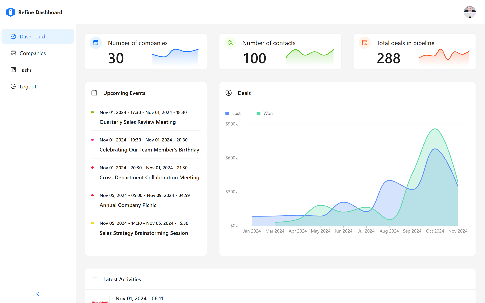

# 📊 Refind Dashboard  

A professional analytics dashboard built with React, Ant Design, and GraphQL. Designed for real-world business workflows, it features demo accounts for users to explore all functionality without signing up.  

---

## 🚀 Features  
- **Analytics:** Main dashboard with latest activities, upcoming sections, revenue tracking, number of contracts, deals, and total pipeline.  
- **Company Management:** Create, edit, and manage companies with full CRUD operations.  
- **Tasks & Kanban Board:** Drag-and-drop task management with sections for unassigned, to review, and completed tasks.  
- **Profile Settings:** Users can update their profile information.  
- **Secure Access:** Demo accounts provided; no self-signup.  

---

## 📸 Preview  
 

---

## 🛠️ Tech Stack  
- React  
- Ant Design & @refinedev/antd components  
- GraphQL & graphql-ws  
- @refinedev/core & @refinedev/react-router  
- @dnd-kit/core for drag-and-drop  
- Day.js for date handling  

---

## 🌐 Live Demo  
👉 [refine-dashboard.firdavs.codes](https://refine-dashboard.firdavs.codes)  

---

## 📦 Installation  

```bash
# Clone the repository
git clone https://github.com/yourusername/refind-dashboard.git

# Navigate to the project folder
cd refind-dashboard

# Install dependencies
npm install

# Start the development server
npm start
```
---

# cute-parents-fail

<div align="center" style="margin: 30px;">
    <a href="https://refine.dev">
    
    </a>
</div>
<br/>

This [Refine](https://github.com/refinedev/refine) project was generated with [create refine-app](https://github.com/refinedev/refine/tree/master/packages/create-refine-app).

## Getting Started

A React Framework for building internal tools, admin panels, dashboards & B2B apps with unmatched flexibility ✨

Refine's hooks and components simplifies the development process and eliminates the repetitive tasks by providing industry-standard solutions for crucial aspects of a project, including authentication, access control, routing, networking, state management, and i18n.

## Available Scripts

### Running the development server.

```bash
    npm run dev
```

### Building for production.

```bash
    npm run build
```

### Running the production server.

```bash
    npm run start
```

## Learn More

To learn more about **Refine**, please check out the [Documentation](https://refine.dev/docs)

- **NestJS Query Data Provider** [Docs](https://refine.dev/docs/data/packages/nestjs-query/)
- **Ant Design** [Docs](https://refine.dev/docs/ui-frameworks/antd/tutorial/)
- **React Router** [Docs](https://refine.dev/docs/core/providers/router-provider/)
- **Custom Auth Provider** [Docs](https://refine.dev/docs/core/providers/auth-provider/)

## License

MIT
